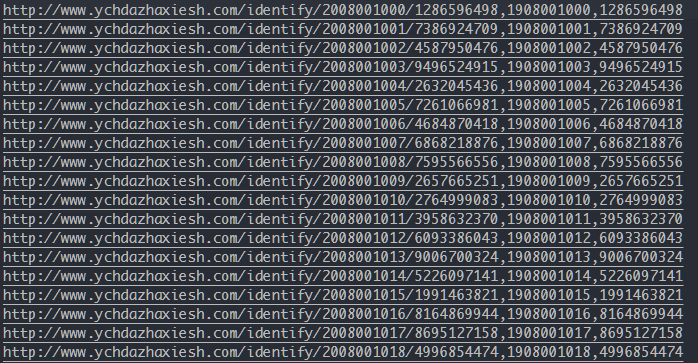

# 操作手册
---------

- ## 二维码
  **1. 生成**

     登陆后台，展开操作菜单 `二维码` > `生成` 。该功能可以生成指定个数的二维码并关联这些二维码数据到指定的会员。
     - **开始序列号** - *不可编辑*, 代表当前生成的序列号的起始值，也代表了已经生成了多少个二维码。序列号生成自增长，步长为1。序列号是由前缀和自增长序列组成的，默认设置为：总长10位，前缀两位为19，后面为8位自增长序列。 这些组成可以通过二维码的配置功能重置。**需要注意的是，重置配置后，生成的二维码和相关的信息都会被清空**。
     - **生成个数** - 代表你要生成的个数，必填，必须是数字。
     - **会员** - 可选参数，如果选择会员，生成的二维码就会自动关联到指定的会员。如果不关联可以后续通过**导出**或者**更新**操作来关联。
    

  **2. 导出**

     登陆后台，展开操作菜单 `二维码` >`导出` 。该功能可以导出并关联指定位置的二维码数据到一个**csv**格式文件，以供生成二维码图。
     - **开始位置** - 序列号的开始位置，只需要填写自增序列的位置，无需前缀和补位的0。
     - **结束位置** - 序列号的结束位置，只需要填写自增序列的位置，无需前缀和补位的0。
     - **会员** - 可选参数，如果选择会员，生成的二维码就会自动关联到指定的会员。如果不关联可以后续通过**更新**操作来关联。
    
    

  **3. 修改**

     登陆后台，展开操作菜单 `二维码` > `修改` 。该功能可以关联会员到指定位置段的二维码数据或者删除指定位置段的二维码数据。
     - **开始位置** - 序列号的开始位置，只需要填写自增序列的位置，无需前缀和补位的0。
     - **结束位置** - 序列号的结束位置，只需要填写自增序列的位置，无需前缀和补位的0。
     - **会员** - 执行**更新**操作时必填，如果选择会员，生成的二维码就会自动关联到指定的会员。
     

  **4. 配置**

     登陆后台，展开操作菜单 `二维码` > `配置` 。 功能提供了修改序列号长度的防伪码的长度以及序列号的前缀。 注意，执行前必须先点击清空来清空已有的表数据。使用场景为新一季开始前，开始准备新一季的二维码数据，点击清空。配置前缀长度保存后可以生成新一季的二维码并使用。
     - **序列号前缀** - 必填，长度可以2到4位。
     - **序列号长度** - 选填，默认为10。注意序列号长度过短将影响实际生成的最大二维码个数。二维码最大个数和前缀和序列号存在如下关系：
     ```
     二维码最大个数 = 10^(序列号长度-前缀长度)
     ```
     - **防伪号长度** - 选填，默认为10。
     

- ## 会员
  **1. 添加**

    登陆后台, 展开操作菜单 `会员` > `添加` 。该功能提供了添加新会员的入口。需要注意的是，会员的名字和电话是必填的。
    - **名字** - 必填。不能和已添加过的会员重复，如有重复系统会提示已经存在。
    - **电话** - 必填，必须是合法的电话号码格式，否则会验证失败无法添加。
    - **首页** - 可选，必须是合法的网址。
    - **商标注册** - 可选，商标注册图片，注意只支持**jpg**或者**jpeg**格式，大小不得超过**2M**。
    - **营业执照** - 可选，营业执照图片，注意只支持**jpg**或者**jpeg**格式，大小不得超过**2M**。
    - **商会单位** - 可选，商会单位图片，注意只支持**jpg**或者**jpeg**格式，大小不得超过**2M**。
    

  **2. 修改**

    登陆后台，展开操作菜单 `会员` > `修改` 。该功能提供了更新或删除新会员的入口。
    - **会员** - 可选会员下下拉列表。删除时候必选。
    - **电话** - 执行更新时候必填，必须是合法的电话号码格式，否则会验证失败无法添加。
    - **首页** - 可选，必须是合法的网址。
    - **商标注册** - 可选，商标注册图片，注意只支持**jpg**或者**jpeg**格式，大小不得超过**2M**。
    - **营业执照** - 可选，营业执照图片，注意只支持**jpg**或者**jpeg**格式，大小不得超过**2M**。
    - **商会单位** - 可选，商会单位图片，注意只支持**jpg**或者**jpeg**格式，大小不得超过**2M**。
    **注意，更新的时候，三个图片中必须有一个，电话号码不能为空。只有修改了某些数据，更新按钮才可用。**
    

- ## 用户
  **1. 添加**

  登陆后台, 展开操作菜单 `用户` > `添加` 。该功能可以为系统添加新的管理员。
  - **用户名** - 必填，用户名必须字母开头的3到10位的字符串(可以是字母数字下划线)。
  - **密码** - 必填，密码必须是5到16位字母数字下划线的组合。
   

  **2. 修改**

   登陆后台, 展开操作菜单 `用户` > `修改` 。该功能可以为除了admin以外的管理员修改密码或者删除。
   - **用户名** - 除了admin以外的所有用户下拉列表。
   - **密码** - 修改密码时必填，密码必须是5到16位字母数字下划线的组合。
    